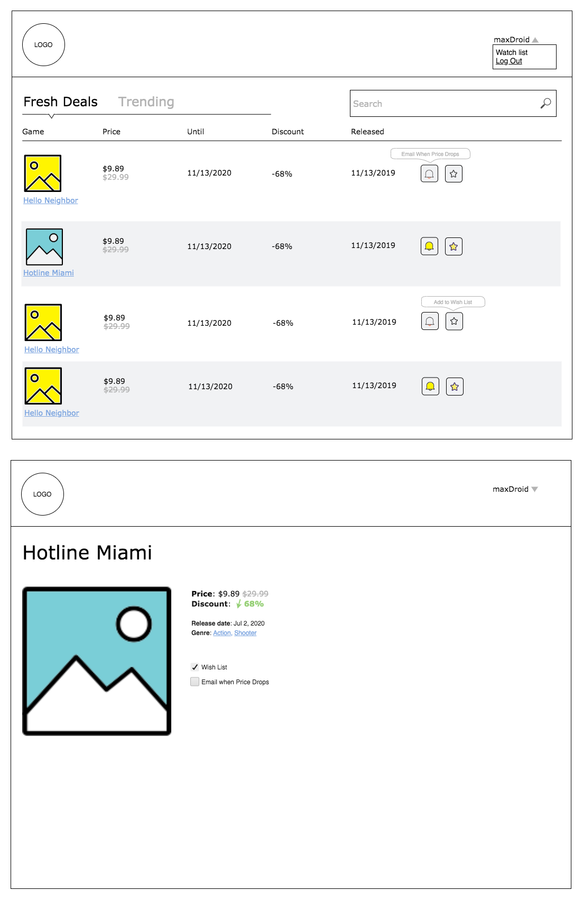

### 👷 Frontend Engineer Code Challenge

## Tech Requirements

- Create a simple single-page app using [Create React App](https://github.com/facebook/create-react-app) or [Gatsby](https://www.gatsbyjs.org/) as a boilerplate based on your preference.

- To style React Components feel free to use ether CSS Modules or Styled-components.

- The pages have to be responsive.

## What is the app about?

It's a light price monitoring web-based application that displays Nintendo Switch games, which are currently on sale. 

To extract games and pricing information use [nintendo-switch-eshop library](https://lmmfranco.github.io/nintendo-switch-eshop/index.html)

Refer to the mockup for layout and basic functionality. 
The state of the actions for buttons `Add To Wish-List` and `Email When Price Drops` could be saved in local state or local storage.

Search, pagination and tabs could be omitted, leaving only ability to display first 10 games from the recent Deals.

## The aspects of your code will be revied based on

- [ ] Code quality: clean, readable and reusable code.
- [ ] Clarity:  Does the README clearly and concisely explain the problem and solution? Are technical trade offs explained?

The code for this assignment needs to be hosted on GitHub and a working version, preferably(not a must) accessible via web.
